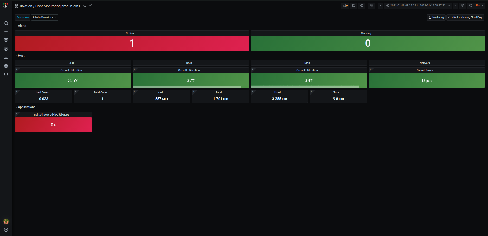

# dNation Kubernetes Monitoring

See status of your Kubernetes infrastructure and applications at a glance using semaphore (green/orange/red) principle:

It is a set of Grafana dashboards and Prometheus alerts written in [Jsonnet](https://jsonnet.org/). This Monitoring following 3 basic design principles:

1. `Intuitive` - Green, orange and red colors signaling whether or not your action is needed
1. `Drill-down` - if you want details why something is green, orange or red, just click it
1. `Relevant information only` - provide only metrics relevant for this particular area of interest and drill-down level, side-by-side with logs (experimental feature)

Monitoring targets are:

| Kubernetes | Hosts | Applications |
|:----------:|:-----------:|:------------------:|
|  |  |  |

# Full Installation
In case your current Kubernetes installation doesn't contain Prometheus Operator, Grafana or Loki, please install [dNation Kubernetes Monitoring Stack](https://github.com/dNationCloud/kubernetes-monitoring-stack) helm chart (recommended).

# Dashboards and Alerts only Installation
In case your current Kubernetes installation already contains Prometheus Operator, Grafana and Loki, please follow [here](GETTING_STARTED.md).

# Documentation
See the [documentation](https://dnationcloud.github.io/kubernetes-monitoring/docs/documentation) and [FAQ](https://dnationcloud.github.io/kubernetes-monitoring/helpers/FAQ/) for further information.  

# Contribution guidelines
If you want to contribute, please read following:

1. [Contribution Guidelines](CONTRIBUTING.md) 
1. [Code of Conduct](CODE_OF_CONDUCT.md) 
1. [How To](helpers/README.md) simplify your local development

We use GitHub issues to manage requests and bugs.

# Commercial support
This project has been developed, maintained and used in production by professionals to simplify their day-to-day monitoring tasks and reduce incident reaction time.

Commercial support is available, including 24/7, please [contact us](mailto:cloud@dNation.cloud?subject=Request%20for%20commercial%20support%20of%20dNation%20Kubernetes%20Monitoring).
