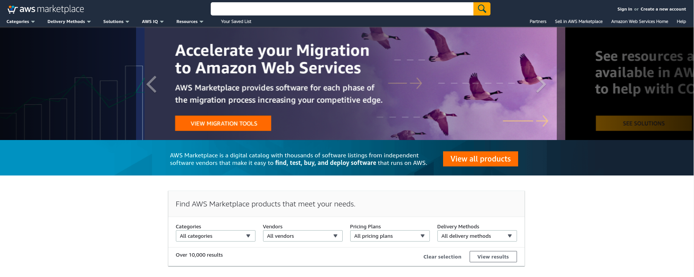
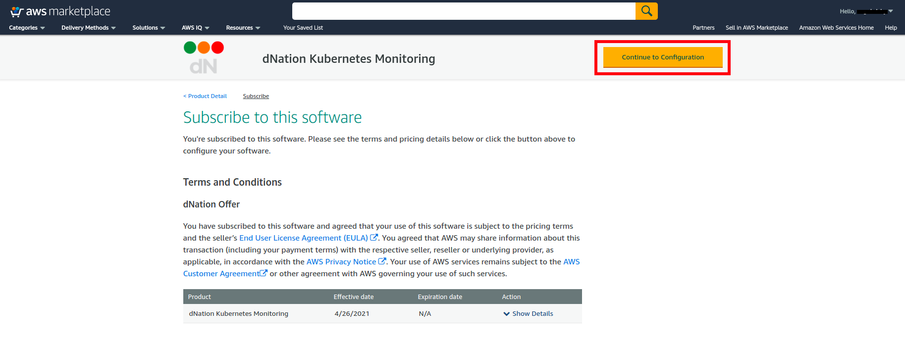
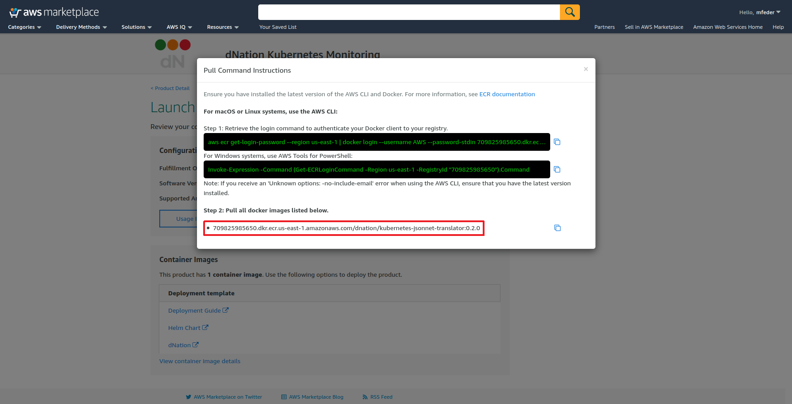
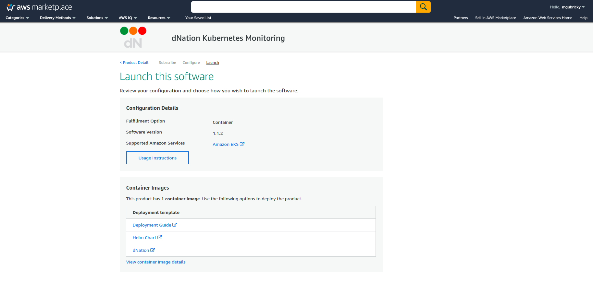

## Get Started With dNation Cloud Chart Using Amazon EKS And The AWS Marketplace

### Introduction

[Amazon Web Services](https://aws.amazon.com/) (AWS) provides a number of different cloud and container services, including the [Amazon Elastic Container Service for Kubernetes](https://aws.amazon.com/eks/) (EKS), which allows users to quickly and easily create Kubernetes clusters in the cloud. But starting up a cluster is just the beginning: the next step is to deploy applications and monitor them.

That’s where this tutorial comes in. It will walk you, step by step, through the process of using the [AWS Marketplace](https://aws.amazon.com/marketplace) to deploy dNation Kubernetes monitoring on a running EKS cluster.

### Overview

This guide will walk you through the process of deploying and managing applications in an EKS cluster using the [AWS Marketplace](https://aws.amazon.com/marketplace) and [Helm](https://helm.sh/). This guide will show you the steps to deploy the [dNation Kubernetes Monitoring Helm chart](https://github.com/dNationCloud/kubernetes-monitoring) on your EKS cluster with Helm.

Here are the steps you’ll follow in this tutorial:

- Subscribe to the dNation Kubernetes Monitoring using the AWS Marketplace
- Deploy the dNation Kubernetes Monitoring Helm chart on EKS through Helm
- Log in and start using dNation Kubernetes Monitoring

The next sections will walk you through these steps in detail.

### Assumptions And Prerequisites

This guide assumes that:

- You have an active AWS account. If you don’t have this, [create a new account](https://aws.amazon.com/).
- You have a running EKS cluster with a minimal two nodes with allocatable 11 pods per node, e.g. instances like t2.small or t3.small and higher. And also Helm 3.x, *kubectl* are installed.

### Step 1: Subscribe To The dNation Kubernetes Monitoring Using The AWS Marketplace

At the end of this step, you will have subscribed to the dNation Kubernetes Monitoring solution in the AWS Marketplace.

Follow these steps:

- Log in to the [AWS Marketplace](https://aws.amazon.com/marketplace).


  

- Search for the dNation Kubernetes Monitoring by entering the search term “dNation kubernetes monitoring” in the search bar at the top.
- Select the dNation Kubernetes Monitoring in the list of search results.
- On the product detail page, review the details of the solution and click the “Continue to subscribe” button.


  

- On the product subscription page, select “Continue to configuration” as accept the terms and pricing.


  

- On the product configuration page, select delivery method as “Container” , select Software version and click the “Continue to Launch“.


  

- On the launch page, select “View container image details“ and copy the URL to the AWS Marketplace registry.
  You will need these details in installation.


  

- Review your configuration, select “Deployment Guide“ and follow step-by-step instructions for installing dNation Kubernetes Monitoring.


  


### Step 2: Deploy dNation Kubernetes Monitoring Helm Chart On EKS

At the end of this step, you will have deployed dNation Kubernetes Monitoring on your EKS cluster.

The next step is to deploy dNation Kubernetes Monitoring on your EKS cluster. The easiest way to do this is with a Helm chart.

Follow these steps:

- Add dNation helm repository and update it.
  ``` bash
  # Add dNation helm repository
  helm repo add dnationcloud https://dnationcloud.github.io/helm-hub/
  helm repo update
  ```

- It is a good practice to install new packages in a separate namespace, as it is easier to manage it this way. Create a new namespace, for example call it "monitoring"
  ```bash
  kubectl create namespace monitoring
  ```

- In case your current Kubernetes installation doesn't contain Prometheus Operator, Grafana or Loki, please install dNation Kubernetes Monitoring Stack helm chart (recommended) with dNation Kubernetes Monitoring Chart
  ```bash
  # Install dNation Kubernetes Monitoring Stack with dNation Kubernetes Monitoring chart
  helm upgrade --install dnation-kubernetes-monitoring-stack dnationcloud/dnation-kubernetes-monitoring-stack --namespace monitoring --set dnation-kubernetes-monitoring.dnation-kubernetes-jsonnet-translator.image.repository=709825985650.dkr.ecr.us-east-1.amazonaws.com/dnation/kubernetes-jsonnet-translator --set dnation-kubernetes-monitoring.dnation-kubernetes-jsonnet-translator.image.tag=<image-tag> --version=<helm-chart-version>
  ```
  Example of installation for helm chart version `1.1.2`:
  ```bash
  # Install dNation Kubernetes Monitoring Stack with dNation Kubernetes Monitoring chart
  helm upgrade --install dnation-kubernetes-monitoring-stack dnationcloud/dnation-kubernetes-monitoring-stack --namespace monitoring --set dnation-kubernetes-monitoring.dnation-kubernetes-jsonnet-translator.image.repository=709825985650.dkr.ecr.us-east-1.amazonaws.com/dnation/kubernetes-jsonnet-translator --set dnation-kubernetes-monitoring.dnation-kubernetes-jsonnet-translator.image.tag=0.2.0 --version=1.1.2
  ```
  
- If your current Kubernetes installation already contains Prometheus Operator, Grafana and Loki, please follow this
  ```bash
  # Install dNation Kubernetes Monitoring
  helm upgrade --install dnation-kubernetes-monitoring dnationcloud/dnation-kubernetes-monitoring --namespace monitoring --set dnation-kubernetes-jsonnet-translator.image.repository=709825985650.dkr.ecr.us-east-1.amazonaws.com/dnation/kubernetes-jsonnet-translator --set dnation-kubernetes-monitoring.dnation-kubernetes-jsonnet-translator.image.tag=<image-tag> --version=<helm-chart-version>
  ```
  Example of installation for helm chart version `1.1.2`:
  ```bash
  # Install dNation Kubernetes Monitoring
  helm upgrade --install dnation-kubernetes-monitoring dnationcloud/dnation-kubernetes-monitoring --namespace monitoring --set dnation-kubernetes-jsonnet-translator.image.repository=709825985650.dkr.ecr.us-east-1.amazonaws.com/dnation/kubernetes-jsonnet-translator --set dnation-kubernetes-monitoring.dnation-kubernetes-jsonnet-translator.image.tag=0.2.0 --version=1.1.2
  ```

- Check its status by running
  ```bash
  kubectl get pods --namespace monitoring 
  ```

### Step 3: Log In And Start Using dNation Kubernetes Monitoring

At the end of this step, you will have logged in to the dNation Kubernetes Monitoring.

To log in to the dNation Kubernetes Monitoring dashboard, follow these steps:

- Get your 'admin' user password by running
  ```bash
  kubectl --namespace monitoring get secret dnation-kubernetes-monitoring-stack-grafana -o jsonpath="{.data.admin-password}" | base64 --decode ; echo
  ```

- Use Port Forwarding if you want to access the Grafana server from outside your cluster
  ```bash
  export POD_NAME=$(kubectl get pods --namespace monitoring -l "app.kubernetes.io/name=grafana,app.kubernetes.io/instance=dnation-kubernetes-monitoring-stack" -o jsonpath="{.items[0].metadata.name}")
  kubectl --namespace monitoring port-forward $POD_NAME 3000
  ```

- If you didn't modify the default values the Grafana server is exposed by ClusterIP service and can be accessed via port 80 on the DNS name. Usually at the URL *http://DNS/* or if you used Port Forwarding at *http://localhost:3000/*


  

- Login with the password you obtained at the first bullet point and the username: 'admin', then you should arrive at 'Home' page


  

- Click on the "Search" icon on left hand side and search for `Monitoring` dashboard in the `dNation` directory and you will see "L0 layer", where your cluster and hosts will be displayed. 


  

- If you want to see more information about your cluster, just drill down by left-clicking on the state panel. The fun starts here :)


  

If you want to set the `Monitoring` dashboard as a home dashboard follow [here](https://grafana.com/docs/grafana/latest/administration/change-home-dashboard/#set-the-default-dashboard-through-preferences). If you're experiencing issues please read the [documentation](https://dnationcloud.github.io/kubernetes-monitoring/docs/documentation) and [FAQ](https://dnationcloud.github.io/kubernetes-monitoring/helpers/FAQ/).

**Happy Monitoring !**

### Useful Links

To learn more about the topics discussed in this tutorial, use the links below:

- [Amazon EKS](https://aws.amazon.com/eks/)
- [Kubernetes](https://kubernetes.io/)
- [Helm](https://helm.sh/)
- [dNation Kubernetes Monitoring](https://github.com/dNationCloud/kubernetes-monitoring)
- [dNation Cloud](https://dnation.cloud/)
