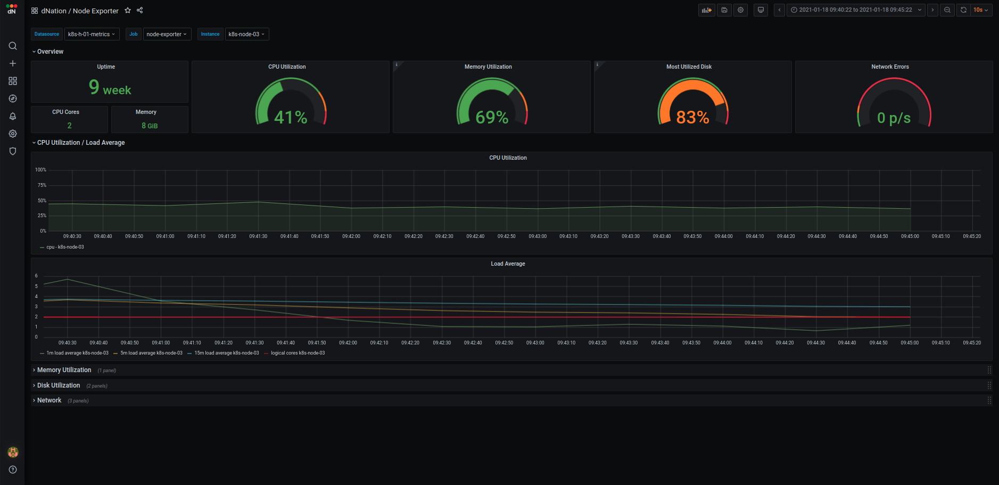

# Frequently Asked Questions (FAQ)

## How to interpret displayed monitoring values across different monitoring layers?

### Monitoring Layer 0


#### Kubernetes monitoring
Kubernetes cluster health is simply represented by the single state panel. State panel aggregates alerts from the 
underlying layer of kubernetes monitoring. The healthy status is represented by the green state panel with 'OK' label. It is displayed if the k8s cluster meets all the defined thresholds for healthy status. When some threshold is crossed and this state  persists for **5** minutes (default), relevant alert is triggered and highlighted. The orange state panel  with `Warning` label is displayed in case of warning alert. Red state panel with  `Critical` label is displayed in case of critical alert. 
This simple and intuitive green, orange and red colors principle signalizing whether or not your action is needed. If you want to see more informations about your k8s cluster, just drill down by left-clicking on 
the relevant state panel. As of now, only single cluster monitoring is supported. Multi cluster monitoring support is under development. 
- If you are interested in the k8s cluster monitoring see [How to set up k8s cluster monitoring?](#how-to-set-up-k8s-cluster-monitoring) section.

#### Host monitoring
Host monitoring integration allows you to monitor your hosts infrastructure within our kubernetes based, 
stable and highly available monitoring. Hosts state panel functions on the same principles as k8s cluster state panel. Multi host 
monitoring is supported.
- If you are interested in the host monitoring see [How to set up host monitoring?](#how-to-set-up-host-monitoring) section.

### K8s monitoring Layer 1

The first layer of k8s monitoring consists of state panels that visualize the current state of your k8s cluster. The state
panels are separated into several sections:
- Alerts
- Overview
- Control Plane Components Health
- Node Metrics (including Master)
- Applications (optional)

When a failed condition of monitored k8s element occurs the state panel shows lowered percentage value on health indicator. If the state of health is too 
low and the percentage value reached warning or even critical threshold, corresponding state panel changes its color.
Intuitive green, orange and red color principle is used. When failed state lasts longer than **5** minutes (default) then 
the relevant alert is triggered and highlighted in alert panel. Also the panel representing the overall health of the k8s cluster in the monitoring layer 0 changes accordingly.
The first layer is the source of all aggregated k8s cluster alerts triggered by dNation monitoring.
 
#### Alerts
The upper section shows the amount of triggered critical and warning alerts. If you want to see detailed list of 
triggered alerts simply apply the drill down principle.

#### Overview
The overview section allows you to monitor the health status of k8s nodes, workloads (deployments, stateful sets, daemon sets, pods, containers and more)
and persistent volumes. Each state panel conatains important information of monitored k8s element, e.g. single node health state panel 
gives you an insight on whether the k8s nodes are able to schedule resources or if they are under disk, memory or PID pressure.

#### Control Plane Components
Monitoring of k8s cluster control plane components (api server, controller manager, etcd database, kubelet, proxy and scheduler) 
is located in the separate section. If you want to check the work queue rate of controller manager or scheduler latency this section
is the right place to see.

#### Node Metrics (including Master)
Measure k8s nodes system metrics is important in ensuring k8s cluster availability. Node Metrics section gives you a clear overview
of cluster's CPU, memory, disk and network utilization. Each system metric is visualized in several state panels such as overall (average) utilization panel, the most utilized cluster node panel and information panels which show
used and total state of system metric. It is always useful to know overall cluster utilization 
but also it is important to know when one node is more utilized then others which may indicates that your
k8s cluster does not work properly. 
If you want to drill down for further investigation of your k8s node you can select between `System Overview` or `K8s Overview` buttons.
`System Overview` shows what you expected i.e. CPU, memory, disk and network utilization per k8s cluster node in detail.         
`K8s Overview` shows system resources usage in k8s oriented way, it means that you can filter particular k8s workload per k8s cluster node
or see information about CPU and memory requests and limits.

#### Applications
In order to thoroughly understand application health, we created custom dashboards which help us to
deeply understand and diagnose application workloads in k8s cluster. Currently, we designed several dashboards for well known and widely used 
frameworks such as java actuator, python flask, nginx ingress controller and more. Layer 1 state panels aggregate 
important information of monitored application, green, orange and red colors principle inform us if there is some action needed and 
drill down principle can be used to access rich and detailed application dashboard. 

- If you want to customize your L1 layer by custom k8s monitoring template definition, see [How to customize my k8s monitoring?](#how-to-customize-my-k8s-monitoring) section.
- If you are interested in the k8s application monitoring, see [How to set up k8s application monitoring?](#how-to-set-up-k8s-application-monitoring) section.

### K8s monitoring lower layers
If you want to know details why is some stats panel in upper layer green, orange or red, just drill down and click it.
See some examples from layer 2 and layer 3 of k8s monitoring:

- K8s monitoring Layer 2 examples

  | Containers | Nodes Disks | Application |
  |:----------:|:-----------:|:------------------:|
  |   |  |  |

- K8s monitoring Layer 3 examples

  | Containers | Nodes |
  |:----------:|:-----------:|
  |   |  |

### Host monitoring Layer 1

The host monitoring layer 1 consists from a bunch of state panels that clearly visualize the current state of your host. The state
panels are separated into several logical sections:
- Alerts
- Host
- Applications (optional)

When some failed condition of monitored element occurs, state panel shows lower percentage value of health. If the health state is too 
low and value reached defined warning or even critical threshold level then the corresponding state panel change background color.
Simple and intuitive green, orange and red colors principle is used. When failed state persist for **5** minutes (default) then 
the relevant alert will be triggered and highlighted in alert panel and also the overall host health panel in the monitoring layer 0 is changed too.
The host layer 1 is the source of all aggregated host alerts triggered by dNation monitoring.

#### Alerts
The upper section shows the number of triggered critical and warning alerts. If you want to see detailed list of 
triggered alerts apply the drill down principle and see the list with detailed information. 

#### Host
Host section gives you a clear overview of host's CPU, memory, disk and network utilization.
Each system metric is visualized in several state panels. The main host overall utilization panel and information panels which show
used and total state of system metric.

#### Applications
In order to thoroughly understand application health, we created custom dashboards which help us to
deeply understand and diagnose host applications. Currently, we designed several dashboards such cadvisor.
Layer 1 state panels aggregate important information of monitored application, green, orange and red colors principle 
inform us if there is some action needed and drill down principle can be used to access rich and detailed application dashboard. 

- If you want to customize your L1 layer by custom host monitoring template definition, see [How to customize my host monitoring?](#how-to-customize-my-host-monitoring) section.
- If you are interested in the host application monitoring, see [How to set up host application monitoring?](#how-to-set-up-host-application-monitoring) section.

### Host monitoring lower layers
If you want to know details why is some stats panel in upper layer green, orange or red, just drill down and click it.
See some examples from layer 2 of host monitoring:

| Host Detail  | Application |
|:----------:|:------------------:|
|   |  |


## How to set up k8s cluster monitoring?
### Prerequisites
Install dNation k8s monitoring on k8s cluster, see [here](https://github.com/dNationCloud/kubernetes-monitoring#full-installation). 
### Set up
K8s cluster monitoring is enabled by default. See the [docs](https://dnationcloud.github.io/kubernetes-monitoring/docs/documentation/#clustermonitoring):
```yaml
clusterMonitoring:
  enabled: true
  clusters:
  - name: K8sCluster
    description: 'Kubernetes cluster monitoring'
    apps: []
```
It means that your k8s cluster is monitored right after installation of dNation k8s monitoring.
If you want to customize k8s cluster monitoring see [How to customize my k8s monitoring?](#how-to-customize-my-k8s-monitoring) section.

## How to customize my k8s monitoring?

We understand that each k8s cluster may contain various workloads, or may have configured various scaling strategies.
We tried to do our best and set up suitable defaults based on our production environment experiences, but we understand that 
we could not cover variety of k8s cluster configurations. Based on above, we implemented the template logic that allows you to
fully customize the default state panels or alerts and also you can create your own to fulfill your k8s cluster monitoring requirements.
Currently, layer 1 customization is implemented. The templating of other layers is under development.
For full list of k8s templates see the [docs](https://dnationcloud.github.io/kubernetes-monitoring/docs/documentation/#templates).

If you want to customize some existing (default) layer 1 template in k8s monitoring just create a simple yaml file:
```yaml
templates:
  k8s:
    # Override stats panel title and warning thresholds for the etcd health panel
    etcdHealth:
      panel:
        title: "Custom Title"
        thresholds:
          warning: 96
      alert:
        thresholds:
          warning: 96
```
Each state panel which can be modified contains a template name in its description for easy navigation:


Finally, update your k8s monitoring deployment and override the default monitoring configuration:
```bash
helm upgrade [RELEASE] [CHART] -f override.yaml
```
If you want to create your own custom template see full examples in the `helpers` directory.

## How to set up k8s application monitoring?
### Prerequisites
Enable or install metrics exporter in your k8s application.
### Set up
K8s application monitoring is disabled by default. See the [docs](https://dnationcloud.github.io/kubernetes-monitoring/docs/documentation/#clustermonitoring).
To enable it just create application monitoring definition as follows:
```yaml
clusterMonitoring:
  enabled: true
  clusters:
  - name: K8sCluster
    description: 'Kubernetes cluster with application monitoring'
    apps:
    - name: app-example
      description: Example of App Monitoring
      jobName: flask-app  # The job name should be the same as the name which will be retrieved from the `jobLabel`, see the `serviceMonitor` section
      template:
        javaActuator:  # Application Exporter template
          enabled: true
      serviceMonitor:
        jobLabel: app # The label to use to retrieve the job name from.
        namespaceSelector:  # Namespaces to transfer from the kubernetes service to the target
          matchNames:
          - default
        selector:  # Label selector for services to which this ServiceMonitor applies
          matchLabels:
            app: flask-app
        # Endpoints of the selected service to be monitored
        # ref: https://github.com/prometheus-operator/prometheus-operator/blob/master/Documentation/api.md#endpoint
        endpoints:
        - targetPort: metrics  # Name or number of the endpoint's target port
          path: /metrics  # HTTP path to scrape for metrics
```

Application monitoring definition contains two main sections: `template` and `serviceMonitor` or `podMonitor` respectively.
The `template` section defines which template and pre-defined application dashboard will be used.
For full list of pre-defined k8s application templates see the [docs](https://dnationcloud.github.io/kubernetes-monitoring/docs/documentation/#k8sapps).
Application monitoring metrics endpoint is auto-discovered by [service monitor](https://github.com/prometheus-operator/prometheus-operator/blob/master/Documentation/api.md#servicemonitor) 
or [pod monitor](https://github.com/prometheus-operator/prometheus-operator/blob/master/Documentation/api.md#podmonitor) CRDs.
See the documentation of CRDs to ensure that your application metrics endpoint will be discovered as you want or find some 
examples in `helpers` directory.

Finally, update your k8s monitoring deployment and apply the application monitoring configuration:
```bash
helm upgrade [RELEASE] [CHART] -f apps.yaml
```
- If you want to customize the default application template see [How to customize my k8s monitoring?](#how-to-customize-my-k8s-monitoring) section.


## How to set up host monitoring?
### Prerequisites
Enable or install [node exporter](https://github.com/prometheus/node_exporter) in your host. You can use `helpers/node_exporter.sh` installation script.
### Set up
Host monitoring is disabled by default. See the [docs](https://dnationcloud.github.io/kubernetes-monitoring/docs/documentation/#hostmonitoring).
To enable it just create host monitoring definition as follows:
```yaml
hostMonitoring:
  enabled: true
  hosts:
  - name: host-01
    description: Host 01
    jobName: host-01
    host:
      address: 1.1.1.1  # Host IP address
    serviceMonitor:
      endpoints:
      - port: 9100  # Node exporter port
        path: /metrics  # Node exporter metrics path
```
Host monitoring definition contains two main sections: `host` and `serviceMonitor`.
The `host` section simply defines the host IP address. The `serviceMonitor` defines [service monitor](https://github.com/prometheus-operator/prometheus-operator/blob/master/Documentation/api.md#servicemonitor)
CRD endpoint i.e. the host's node exporter port and path. Lot of service monitor parameters are pre-configured to simplify host monitoring configuration, if you are interested how, or you want to 
override some of these parameters see the `chart/templates/hosts` directory. 

Finally, update your k8s monitoring deployment and apply the host monitoring configuration:
```bash
helm upgrade [RELEASE] [CHART] -f host.yaml
```

## How to customize my host monitoring?
To cover variety of host configurations we implemented the template logic in the host monitoring as well. Templates allow you to
fully customize the default state panels or alerts and also you can create your own to fulfill your host monitoring requirements.
Currently, layer 1 customization is implemented. For full list of host templates see the [docs](https://dnationcloud.github.io/kubernetes-monitoring/docs/documentation/#templates).

If you want to customize some existing (default) layer 1 template in host monitoring just create a simple yaml file:
```yaml
templates:
  host:
    # Override warning thresholds for the CPU utilization panel
    overallUtilizationCPU:
      panel:
        thresholds:
          warning: 50
      alert:
        thresholds:
          warning: 50
```
Each state panel which can be modified contains a template name in its description for easy navigation:


Finally, update your k8s monitoring deployment and override the default monitoring configuration:
```bash
helm upgrade [RELEASE] [CHART] -f override.yaml
```
If you want to create your own custom template see full examples in the `helpers` directory.
## How to set up host application monitoring?
### Prerequisites
Enable or install metrics exporter in your host application.
### Set up
Hots application monitoring is disabled by default. See the [docs](https://dnationcloud.github.io/kubernetes-monitoring/docs/documentation/#hostmonitoring).
To enable it just create application monitoring definition as follows:
```yaml
hostMonitoring:
  enabled: true
  hosts:
  - name: host-01
    description: 'Host 01 with application monitoring'
    apps:
    - name: host-01-docker
      description: Host 01 Docker Containers
      jobName: host-01-docker
      templates:
        cAdvisor:  # Application Exporter template
          enable: true
      serviceMonitor:
        endpoints:
        - port: 9101  # Application exporter port
          path: /metrics  # Application exporter metrics path
```

Application monitoring definition contains two main sections: `template` and `serviceMonitor`.
The `template` section defines which template and pre-defined application dashboard will be used.
For full list of pre-defined host application templates see the [docs](https://dnationcloud.github.io/kubernetes-monitoring/docs/documentation/#hostapps).
The `serviceMonitor` defines [service monitor](https://github.com/prometheus-operator/prometheus-operator/blob/master/Documentation/api.md#servicemonitor)
CRD endpoint, i.e. the application's exporter port and path. Lot of service monitor parameters are pre-configured to simplify application monitoring configuration. If you are curious how or you want to 
override some of these parameters see the `chart/templates/hosts` directory or find some examples in `helpers` directory.

Finally, update your k8s monitoring deployment and apply the application monitoring configuration:
```bash
helm upgrade [RELEASE] [CHART] -f apps.yaml
```
- If you want to customize the default application template see the [How to customize my host monitoring?](#how-to-customize-my-host-monitoring) section.

## Kubernetes Monitoring shows `DOWN` state for some control plane components. Are control plane components working correctly?

Control plane components work probably well, but their metrics server might be disabled or misconfigured.
You should want  to check address bindings of control plane components' metrics as follows:

The metrics of `etcd` and `kube-proxy` control plane components are by default
bound to the localhost that prometheus instances **cannot** access.
Also make sure metrics of `scheduler` and `controller-manager` control plane
components don't have the same address binding if you want to collect them.

Edit and use `kubeadm_init.yaml` file to configure `kubeadm init` in case of fresh K8s deployment.

```bash
kubeadm init --config=helpers/kubeadm_init.yaml
```

Manual set up in case of already running K8s deployment.

* Setup `etcd` metrics bind address
    ```bash
    # On k8s master node
    cd /etc/kubernetes/manifests/
    sudo vim etcd.yaml
    # Add listen-metrics-urls as etcd command option
    ...
    - --listen-metrics-urls=http://0.0.0.0:2381
    ...
    ```

* Setup `kube-proxy` metrics bind address

    Edit kube-proxy daemon set
    ```bash
    kubectl edit ds kube-proxy -n kube-system
    ...containers:
          - command:
            - /usr/local/bin/kube-proxy
            - --config=/var/lib/kube-proxy/config.conf
            - --hostname-override=$(NODE_NAME)
            - --metrics-bind-address=0.0.0.0  # Add metrics-bind-address line
    ```
    Edit kube-proxy config map
    ```bash
    kubectl -n kube-system edit cm kube-proxy
    ...
        kind: KubeProxyConfiguration
        metricsBindAddress: "0.0.0.0:10249" # Add metrics-bind-address host:port
        mode: ""
    ```
    Delete the kube-proxy pods and reapply the new configuration
    ```bash
    kubectl -n kube-system delete po -l k8s-app=kube-proxy
    ```

* Setup `scheduler` metrics bind address
    ```bash
    # On k8s master node
    cd /etc/kubernetes/manifests/
    sudo vim kube-scheduler.yaml
    # Edit bind-address and port command options
    ...
    - --bind-address=0.0.0.0
    - --port=10251
    ...
    ```

* Setup `controller-manager` metrics bind address
    ```bash
    # On k8s master node
    cd /etc/kubernetes/manifests/
    sudo vim kube-controller-manager.yaml
    # Edit bind-address and port command options
    ...
    - --bind-address=0.0.0.0
    - --port=10252
    ...
    ```
